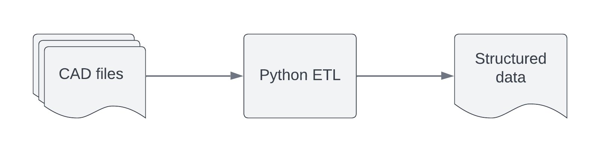

# Multiple file Autocad data extraction 
 Python script for extracting information from Autocad block attributes in multiple documents.



* Uses package EZDXF
Sequence of operations
1) FOR loop for checking unreadable files.
2) Define the function for extracting information from cad files.  
    * Select Autocad block types and defines user-customised parameter for filtering between selected blocks.
    * For each attribute extracts tag information and value in a Python dictionary.
5) FOR loop to run the function on each file in the dxf file folder and return a Python dictionary.
6) Checks number of files read and number of files saved for discrepancy.
7) Pandas dataframe creation and excel export.

Reach me out for any help!

### Script extract
``` python
def extract_attr_dxf(cartella, nomefile):
    doc = ezdxf.readfile("{}/{}".format(cartella, nomefile))
    modelspace = doc.modelspace()
    for n in modelspace:
        if n.dxftype()=="INSERT":
            articolo={}
            if n.has_attrib("NUMEROARTICOLO")==True:
                for attrib in n.attribs:
                    articolo[attrib.dxf.tag]=attrib.dxf.text
                user_defined_dictionary[articolo["NUMEROARTICOLO"]]=articolo

for nomefile in os.listdir(cartella):
  if nomefile.endswith(".dxf"):
    extract_attr_dxf(cartella,nomefile)
```